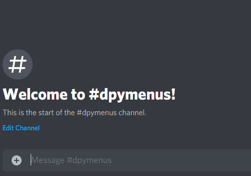

<h1 align="center">Discord Menus</h1>
    
<div align="center">
  <strong><i>Simplified menus for discord.py developers.</i></strong>
  <br>
  <br>
  
  <a href="https://pypi.org/project/dpymenus/">
    
  </a>

  <a href="https://dpymenus.readthedocs.io/en/latest/">
    
  </a>
  
  <a href="https://python.org">
    
  </a>
</div>

<br>



<br>

### Table of Contents
**[Documentation](https://dpymenus.readthedocs.io/en/latest/?badge=latest)**
+ [Getting Started](#getting-started)
+ [Destinations](#destinations)
+ [Data Field](#data-field)
+ [Generic Input Matching](#generic-input-matching)
+ [Reaction Buttons](#reaction-buttons)
+ [Event Callbacks](#event-callbacks)
+ [Helper Methods](#helper-methods)
+ [Poll Utilities](#poll-utilities)

### Getting Started
`dpymenus` is an unofficial add-on for the `discord.py` library that lets you quickly compose various styles of 
menus *(text, buttons, polls)* which react to user input.

You can install the library with `pip install dpymenus`.

This very basic example will get the same menu running as the demo .gif!

```python
import discord
from discord.ext import commands

from dpymenus import PaginatedMenu


class Demo(commands.Cog):
    def __init__(self, client):
        self.client = client

    @commands.command()
    async def demo(self, ctx):
        e1 = discord.Embed(title='Page 1', description='First page test!')
        e1.add_field(name='Example A', value='Example B')

        e2 = discord.Embed(title='Page 2', description='Second page test!')
        e2.add_field(name='Example C', value='Example D')

        e3 = discord.Embed(title='Page 3', description='Third page test!')
        e3.add_field(name='Example E', value='Example F')

        menu = PaginatedMenu(ctx)
        await menu.add_pages([e1, e2, e3])
        await menu.open()


def setup(client):
    client.add_cog(Demo(client))
```

There are more examples in the *examples* directory above, including detailed inline comments
on how to use each menu style (Text, Button, Paginated, and Polls).

Can't find something you were looking for? Open an issue and I'll add a relevant example!

### Destinations
*New 0.3.5*

All Menu types take an optional `destinations` parameter, which can be either a discord.py User
or TextChannel object. This will open the menu at that location instead of the current channel, 
which is the default behaviour.

For example, if we want to open the menu in the authors DM's:

```python
menu = TextMenu(ctx, destination=ctx.author)
```
    
### Data Field
Text and Button menus take an optional parameter called `data` that can be defined for variables or objects you
want to pass around in menu functions. Data should be defined as a dictionary and then passed into your menu on 
initialization::

```python
from dpymenus import TextMenu

my_data = {'username': None, 'favorite_color': None}
menu = TextMenu(ctx, data=my_data)
```

You can then access these like any objects attributes *(ie. `x = menu.data['value']`)*.

*As it is a dictionary, you can set more than strings. For instance,
transferring objects across functions by setting the value to an object. Ideally, the menu 
object should contain all your data until it is ready to be processed. This also simplifies
your code by limiting the amount of parameters functions need to accept when handling
multiple objects related to a single menu.*

### Generic Input Matching
There are also some preset constant variables to use for menus in the constants directory. You can
import what you need as such:

`from dpymenus.constants import *`

The defaults are:
```python
CONFIRM = ('y', 'yes', 'ok', 'k', 'kk', 'ready', 'rdy', 'r', 'confirm', 'okay')
DENY = ('n', 'no', 'deny', 'negative', 'back', 'return')
QUIT = ('e', 'exit', 'q', 'quit', 'stop', 'x', 'cancel', 'c')
```

### Reaction Buttons
Here are some examples of how to acquire emojis in discord.py:
```python
btn1 = client.get_emoji(3487239849812123)  # guild emoji
btn2 = discord.utils.get(ctx.guild.emojis, name='example')  # guild emoji
btn3 = '<:example2:35434643573451>'  # guild emoji
btn4 = '\N{SNAKE}'  # unicode emoji as text
btn5 = '\U00002714'  # unicode emoji codepoint :heavy_check_mark:
```

### Event Callbacks
By default, the base Menu object implements methods for all events except `on_next`, which should
be handled by the user. However, all of these events can be overridden by passing in a method reference
when you instantiate your menu. Note that Polls and Paginated menus implement their own `on_next` methods
and should not be overwritten.

**Events**

`on_next` -- Called when the menu instance calls `.next()`. 

`on_fail` -- Called when user input on a page is invalid. Usable on Text menus.

`on_timeout` -- Called when a menu times out. You can set the `timeout` on menu instantiation.
 Usable on Text, Button, and Paginated menus.

`on_cancel` -- Called when a menu is cancelled from user input.
 Usable on Text, Button, and Paginated menus.


### Helper Methods
`.next()` -- goes forward one page index on the current menu.

`.go_to(x)` -- takes a string or integer *(page callback reference or index)* and jumps to that specific page. 
Useful for non-linear menus.

`.previous()` -- goes back one page index on the current menu.

`.add_pages(x)` -- takes a list of Page objects and adds them to the menu. Useful for adding pre-built embeds to pages
without rewriting them all as Page objects directly. See *premade_embed_button_menu_example.py* in the *examples/*
directory for full use of this helper.


### Poll Utilities
Polls are a fairly complex Menu type, which often require a lot of boiler-plate to be written. dpymenus provides
a handful of quick utility methods on your Poll object that should make using them simpler and faster for basic
use case scenarios.

`.results()` -- Returns a dictionary where the keys are the poll choices, and the values are the final tally.

`.add_results_fields()` -- Adds all the result fields to your closing page.

`.generate_results_page()` -- Adds all the result fields to your closing page as well as calculates the winner or 
a draw.

-----

Check out my other discord.py utility: **[cogwatch](https://github.com/robertwayne/cogwatch)** -- *Automatic hot-reloading for your discord.py command files.*
